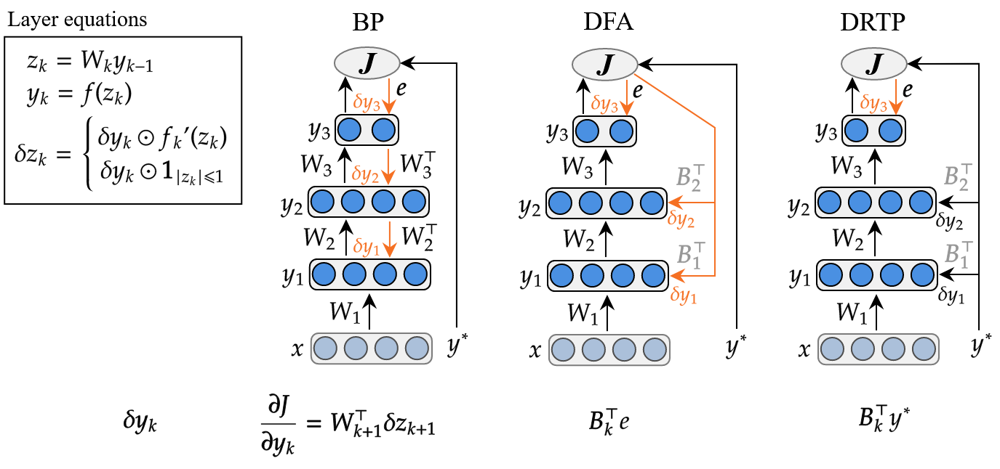

## Dependencies

```
numpy
pyyaml
wandb
tqdm
scikit-learn
keras
tensorflow
objsize
```

`keras` and `tensorflow` are only used for loading datasets.

## Usage

`python -m binary_nn.train --help` prints all options.

Example of execution of the DFA algorithm on CIFAR10 with an entirely binarized model:

```sh
python -m binary_nn.train --dataset CIFAR10 --method DFA --bn --init 0.001 --lr 0.0001 --hidden-act signsat -v -b 128 --epochs 100 --hidden 700,500,300,200 --binarize --weight-clipping 1 --wandb --run-name auto
```

Remove the `--wandb` flag in order to disable Weights & Biases logging.


## Algorithms

The project contains the code for 3 different algorithms that can train deep feed forward neural networks:
Backpropagation (GD, BP), Direct Feedback Alignment (DFA) and Direct Random Target Propagation (DRTP).

The difference between the algorithms are illustrated in the next Figure:




## Project structure

`binary_nn/commons/` contains the code for the common functions and classes (activation functions and layers)

`binary_nn/training/` contains the code for the different training algorithms: GD (BP), DFA, DRTP.

`binary_nn/utils/binary.py` contains binarization utilitaries

`experiments_results/` contains the raw results of the paper experiments extracted from the Weights & Biases logs.

`scripts/` contains diverse utilitary scripts

The `sweeps*.yaml` files are used for initializing grid searches in Weights & Biases.

## Grid search results

For each entry, we display the best hyperparameters (initial value, learning rate) in terms of Accuracy for each algorithm-activation-binarization triplet.

### MNIST without Batch Normalization

| algorithm | activation | binary weights | train/accuracy     | train/f1           | train/precision    | initial value | learning rate | test/accuracy | test/precision     | test/f1            |
|-----------|------------|----------------|--------------------|--------------------|--------------------|---------------|---------------|---------------|--------------------|--------------------|
| dfa       | signsat    | False          | 0.997              | 0.9969844500460621 | 0.996989228825991  | 0.1           | 1.0E-4        | 0.9676        | 0.9672524730093514 | 0.9672354435876253 |
| drtp      | signsat    | False          | 0.9717333333333333 | 0.9714318751413084 | 0.9714287251137501 | 0.1           | 1.0E-4        | 0.9514        | 0.9509186929973443 | 0.9507812074877379 |
| gd        | signsat    | False          | 0.9963333333333333 | 0.9963275297713461 | 0.9963354805992418 | 0.1           | 1.0E-4        | 0.9706        | 0.970454920759282  | 0.9703631066220486 |
| dfa       | tanh       | False          | 0.9999             | 0.9999000130479262 | 0.9999012372043875 | 0.001         | 1.0E-4        | 0.9708        | 0.9704461067060386 | 0.9704379411778568 |
| drtp      | tanh       | False          | 0.9634333333333334 | 0.9630116931133526 | 0.9629777032727642 | 0.001         | 1.0E-4        | 0.9485        | 0.9478478215862027 | 0.9477435960727849 |
| gd        | tanh       | False          | 0.99865            | 0.998646915964178  | 0.9986522863500579 | 0.1           | 1.0E-4        | 0.9811        | 0.9809354698488241 | 0.9808808737504251 |
| dfa       | signsat    | True           | 0.9748333333333333 | 0.9746400891586345 | 0.9746849966805973 | 0.001         | 1.0E-6        | 0.9577        | 0.9573247146551489 | 0.9572748522371743 |
| drtp      | signsat    | True           | 0.924              | 0.9228859352938183 | 0.9229812391356358 | 0.001         | 1.0E-5        | 0.9214        | 0.920432763806558  | 0.9201458162969134 |
| gd        | signsat    | True           | 0.6056833333333334 | 0.5920867565107436 | 0.5921193952058448 | 0.1           | 1.0E-6        | 0.6041        | 0.590221026633945  | 0.5901464260881832 |
| dfa       | tanh       | True           | 0.9804833333333334 | 0.9804009228369706 | 0.9804226214273516 | 0.1           | 1.0E-4        | 0.9641        | 0.9637286940560396 | 0.9637697277457123 |
| drtp      | tanh       | True           | 0.92705            | 0.9260437835428099 | 0.9261424571352463 | 0.001         | 1.0E-5        | 0.9239        | 0.9232291526386962 | 0.922775903385771  |
| gd        | tanh       | True           | 0.91555            | 0.9141193290748099 | 0.9149955905400764 | 0.1           | 1.0E-4        | 0.9096        | 0.9088338730847585 | 0.9078653414472955 |


### MNIST with Batch Normalization

| algorithm | activation | binary weights | train/accuracy     | train/f1           | train/precision    | initial value | learning rate | test/accuracy | test/precision     | test/f1            |
|-----------|------------|----------------|--------------------|--------------------|--------------------|---------------|---------------|---------------|--------------------|--------------------|
| dfa       | signsat    | False          | 0.9997166666666668 | 0.9997166458176552 | 0.9997104173846694 | 0.1           | 1.0E-4        | 0.9732        | 0.9729597484097248 | 0.9729815987663208 |
| drtp      | signsat    | False          | 0.9717333333333333 | 0.9714487362645429 | 0.9713799147983068 | 0.001         | 1.0E-4        | 0.953         | 0.9522640953865091 | 0.952305609108538  |
| gd        | signsat    | False          | 0.99955            | 0.9995527389864403 | 0.9995529356470229 | 0.001         | 1.0E-5        | 0.9826        | 0.982594442906023  | 0.9824757104977533 |
| dfa       | tanh       | False          | 0.99995            | 0.9999526808579209 | 0.9999555226093403 | 0.1           | 1.0E-4        | 0.9758        | 0.9756101075271658 | 0.975587675824381  |
| drtp      | tanh       | False          | 0.9790333333333332 | 0.9788440317719052 | 0.9788143043763512 | 0.001         | 1.0E-4        | 0.9559        | 0.9553004341660796 | 0.9553180023595542 |
| gd        | tanh       | False          | 0.9999333333333333 | 0.9999321803805034 | 0.9999338341976998 | 0.001         | 1.0E-5        | 0.9856        | 0.9857030866978735 | 0.9855371824535206 |
| dfa       | signsat    | True           | 0.9957666666666668 | 0.995740809069057  | 0.995766210865252  | 0.001         | 1.0E-4        | 0.9743        | 0.9741883913270784 | 0.9740942980554635 |
| drtp      | signsat    | True           | 0.9211             | 0.9200212345490966 | 0.9201101625361467 | 0.1           | 1.0E-4        | 0.9216        | 0.9207933493160236 | 0.9204248237032896 |
| gd        | signsat    | True           | 0.99495            | 0.9949133605826674 | 0.9949066357549275 | 0.001         | 1.0E-4        | 0.9709        | 0.9705511135735816 | 0.9705789864759394 |
| dfa       | tanh       | True           | 0.9984666666666666 | 0.9984753433612722 | 0.9985001528990616 | 0.001         | 1.0E-4        | 0.9754        | 0.975358819221405  | 0.9751481180620636 |
| drtp      | tanh       | True           | 0.9244333333333333 | 0.923344765572119  | 0.9239901883987001 | 0.001         | 1.0E-4        | 0.9227        | 0.9220601198909341 | 0.9213970168046884 |
| gd        | tanh       | True           | 0.9993666666666666 | 0.9993743312043094 | 0.9993771481996374 | 0.001         | 1.0E-4        | 0.9807        | 0.980651760818879  | 0.9805629177088704 |


### CIFAR-10 without Batch Normalization

| algorithm | activation | binary weights | train/accuracy | train/f1            | train/precision     | initial value | learning rate | test/accuracy | test/precision      | test/f1             |
|-----------|------------|----------------|----------------|---------------------|---------------------|---------------|---------------|---------------|---------------------|---------------------|
| dfa       | signsat    | False          | 0.99032        | 0.9903179238683192  | 0.990321708618812   | 0.001         | 1.0E-4        | 0.4236        | 0.4225781937349783  | 0.4226655070419768  |
| drtp      | signsat    | False          | 0.61464        | 0.6135747573301401  | 0.615816499442761   | 0.001         | 1.0E-4        | 0.438         | 0.4374655215768242  | 0.4364525477718561  |
| gd        | signsat    | False          | 0.71486        | 0.7141459616361259  | 0.7144805195412388  | 0.1           | 1.0E-4        | 0.4328        | 0.42989757613108504 | 0.42968920471419986 |
| dfa       | tanh       | False          | 1.0            | 1.0                 | 1.0                 | 0.001         | 1.0E-4        | 0.4335        | 0.43419148021938236 | 0.4335536626686528  |
| drtp      | tanh       | False          | 0.5707         | 0.5694057347386453  | 0.5713355508510267  | 0.001         | 1.0E-4        | 0.4474        | 0.4471945626387206  | 0.4459380849624238  |
| gd        | tanh       | False          | 0.93382        | 0.9337787190255088  | 0.9339066717850696  | 0.1           | 1.0E-4        | 0.4484        | 0.44669170385901297 | 0.4468559453559928  |
| dfa       | signsat    | True           | 0.5663         | 0.5642210358833892  | 0.5646039433685012  | 0.001         | 1.0E-6        | 0.4577        | 0.4533477704613896  | 0.4545228172283771  |
| drtp      | signsat    | True           | 0.47466        | 0.4711677620424553  | 0.47228723088143776 | 0.001         | 1.0E-5        | 0.4246        | 0.42138469546297486 | 0.42047643826584286 |
| gd        | signsat    | True           | 0.26298        | 0.2355364262455038  | 0.25158855246508105 | 0.1           | 1.0E-5        | 0.2681        | 0.25523747035317385 | 0.23893727380024926 |
| dfa       | tanh       | True           | 0.63928        | 0.6380050544236116  | 0.6416246725469728  | 0.1           | 1.0E-4        | 0.4304        | 0.4294152667358663  | 0.4278452445165355  |
| drtp      | tanh       | True           | 0.49276        | 0.4905246677846694  | 0.49082186281940887 | 0.001         | 1.0E-5        | 0.4331        | 0.4305412524100478  | 0.4306630465201475  |
| gd        | tanh       | True           | 0.29962        | 0.28076103879268854 | 0.3019480676221184  | 0.1           | 1.0E-5        | 0.2902        | 0.2868005317854075  | 0.2701234665900463  |


### CIFAR-10 with Batch Normalization

| algorithm | activation | binary weights | train/accuracy | train/f1            | train/precision    | initial value | learning rate | test/accuracy | test/precision      | test/f1             |
|-----------|------------|----------------|----------------|---------------------|--------------------|---------------|---------------|---------------|---------------------|---------------------|
| dfa       | signsat    | False          | 0.97866        | 0.9786700620353797  | 0.9787012958998972 | 0.1           | 1.0E-4        | 0.4714        | 0.4731069094895768  | 0.472063635986468   |
| drtp      | signsat    | False          | 0.63366        | 0.6335775641631621  | 0.6396037645735577 | 0.001         | 1.0E-4        | 0.4422        | 0.4476453308585276  | 0.442027079628834   |
| gd        | signsat    | False          | 0.88956        | 0.8895603950617057  | 0.8898121099984433 | 0.001         | 1.0E-4        | 0.4784        | 0.47712672335112627 | 0.4775096805653206  |
| dfa       | tanh       | False          | 0.99966        | 0.9996599999749923  | 0.9996600799455926 | 0.1           | 1.0E-4        | 0.4997        | 0.5005693745752565  | 0.49945851232686056 |
| drtp      | tanh       | False          | 0.64248        | 0.642383894582227   | 0.648358418827772  | 0.001         | 1.0E-4        | 0.4398        | 0.4453188855222402  | 0.43969230708647655 |
| gd        | tanh       | False          | 0.93378        | 0.933756328264382   | 0.9338460735562422 | 0.1           | 1.0E-4        | 0.4544        | 0.4541144960188011  | 0.4532673679512452  |
| dfa       | signsat    | True           | 0.90602        | 0.9063922159806829  | 0.9092612342342443 | 0.001         | 1.0E-4        | 0.49          | 0.4931691699638484  | 0.4896315734269242  |
| drtp      | signsat    | True           | 0.51852        | 0.5159779095429198  | 0.5197300635663875 | 0.001         | 1.0E-4        | 0.4485        | 0.4488233491063247  | 0.44514909991521445 |
| gd        | signsat    | True           | 0.71938        | 0.7194589882848644  | 0.7210107562289872 | 0.001         | 1.0E-4        | 0.4671        | 0.4696131142007481  | 0.46730757764772274 |
| dfa       | tanh       | True           | 0.96438        | 0.9645689927821468  | 0.9654740926733718 | 0.001         | 1.0E-4        | 0.5067        | 0.5107415702494549  | 0.5065686874771227  |
| drtp      | tanh       | True           | 0.5046         | 0.49987333269313183 | 0.5100642410710792 | 0.001         | 1.0E-4        | 0.4447        | 0.4484760211525467  | 0.44039365661658725 |
| gd        | tanh       | True           | 0.8769         | 0.8775076871234934  | 0.8793582105001988 | 0.001         | 1.0E-4        | 0.5107        | 0.5167032061984713  | 0.5116552605884974  |